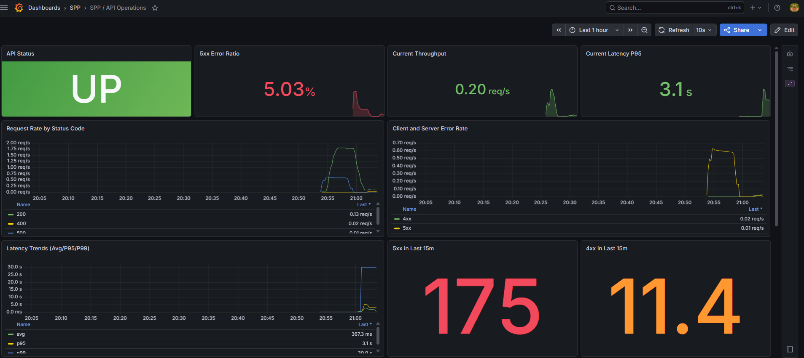
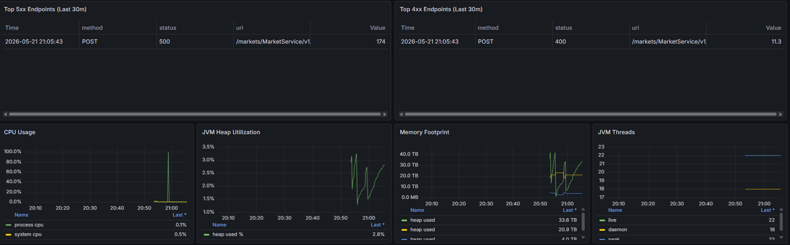

# SPP Demo API


Spring Boot API demo with an OpenAPI-first workflow and a ready-to-run observability stack.

## Features

- OpenAPI-driven contract and generated server interfaces
- Swagger UI for rapid API exploration
- Dockerized local stack for app, metrics, and dashboards
- Prebuilt Grafana panels for API health, latency, and error diagnostics

## Quick Start

### Prerequisites

- Java 25 (local run)
- Docker Desktop or Docker Engine + Docker Compose (container run)

### Run Locally

From the repository root:

Windows (PowerShell)

```powershell
.\mvnw.cmd spring-boot:run
```

macOS/Linux

```bash
./mvnw spring-boot:run
```

### Run With Docker

From the repository root:

```bash
docker compose up --build -d
```

## Endpoints

- API: http://localhost:8080
- Swagger UI: http://localhost:8080/swagger-ui.html
- Prometheus: http://localhost:9090
- Grafana: http://localhost:3000
- Prometheus scrape endpoint from app: http://localhost:8080/actuator/prometheus

Grafana default credentials (local dev): admin / admin

## Observability Stack

Docker Compose starts these services:

- spp-app: Spring Boot API
- prometheus: scrapes app metrics
- grafana: provisioned data source + dashboards


Snapshot 1: Operations overview



Overview of API status, request throughput, latency trends, and error ratios.

Snapshot 2: Diagnostic detail



## Useful Commands

Run tests:

Windows (PowerShell)

```powershell
.\mvnw.cmd test
```

macOS/Linux

```bash
./mvnw test
```

Run a fast compile check:

Windows (PowerShell)

```powershell
.\mvnw.cmd -q -DskipTests compile
```

## OpenAPI Generation

This project uses `src/main/resources/static/openapi/api.yaml` as the single API contract.

During Maven generate-sources, OpenAPI Generator creates Spring API interfaces/controllers and models from that YAML.

Swagger UI is configured to read the same contract from `/openapi/api.yaml` so docs stay aligned with generated code.